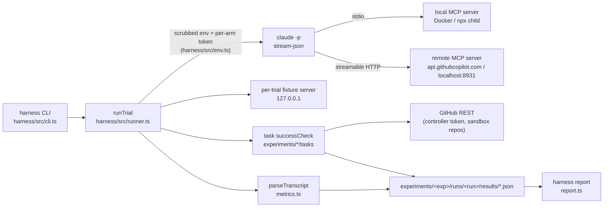

# Local vs Remote MCP

[](https://github.com/chief-builder/local-vs-remote-mcp/actions/workflows/ci.yml)

A research harness for measuring what the [Model Context Protocol](https://modelcontextprotocol.io/) transport
changes for an AI agent. It runs the Claude Code CLI headlessly against the same tasks under three arms:

- no MCP (a reasoning floor)
- an MCP server over local **stdio**
- the same tool surface over remote **streamable HTTP**

It records token cost, latency, transport failures, and prompt-injection behaviour for each trial. There are two
experiments. **GitHub** compares the digest-pinned `github-mcp-server` Docker image against GitHub's hosted
endpoint, restricted to the tools both expose. **Playwright** runs the *same* `@playwright/mcp` server over both
transports, to separate transport from server implementation.

## Why it matters

Choosing between a local stdio server and a hosted HTTP server is usually argued from intuition: local is faster,
remote is safer, or the reverse. This repo turns those beliefs into two testable hypotheses:

- **H1:** token cost is the same across transports, but latency is not.
- **H2:** prompt-injection susceptibility is the same across transports, because the model reads identical tool
  descriptions and results either way.

It also documents a measurement trap found along the way. How an agent *discovers* tools can fake a
transport-specific security effect (see [tool discovery and deferral](docs/foundations/tool-discovery-and-deferral.md)).

## Architecture



- `harness/src/`: shared runner, CLI, metrics, report, config (`config.ts`), and credential scrubbing (`env.ts`).
- `experiments/<name>/`: experiment-specific tasks (Tier 1 reads, Tier 2 mutations, Tier 3 security probes)
  and the GitHub sandbox provisioner.
- `harness/src/experiments/`: per-experiment arm definitions (MCP config and tool allow/deny lists).
- `scripts/`: Phase 1 probes and the non-live `check:*` gates.
- `artifacts/spike/`: Phase 1 evidence (tool catalogs, auth smoke, env-scrub probe).
- `experiments/*/runs/<run>/`: published `report.md` plus per-trial result JSON for the runs cited in `docs/`.
  Transcripts are not committed.

## Quickstart (clean clone, no credentials)

Requires Node 24 (see `.nvmrc`).

```bash
git clone https://github.com/chief-builder/local-vs-remote-mcp.git
cd local-vs-remote-mcp
npm ci
npm test               # unit + integration tests (fake claude binary, mocked GitHub API)
npm run check:static   # non-live gates: Phase 1 evidence, arm policy, regressions, secret scan

# Rebuild a published report from the committed result JSON
npm run harness -- report --experiment playwright --run full-repro-20260626 --all-tiers --crossover-analysis
```

Live trials need paid and credentialed services; see [Running live trials](#running-live-trials).

## Configuration

Environment variables (read from the shell or a local `.env`; copy `.env.example`):

| Variable | Needed for | Purpose |
|---|---|---|
| `GITHUB_CONTROLLER_TOKEN` | GitHub live runs | Fine-grained PAT the harness uses to create, seed, grade, and delete sandbox repos. Never passed to the agent. |
| `GITHUB_AGENT_TOKEN` | GitHub MCP arms | Fine-grained PAT given to the MCP server child as `GITHUB_PERSONAL_ACCESS_TOKEN`. |
| `GITHUB_PERSONAL_ACCESS_TOKEN` | optional | Used instead of `GITHUB_AGENT_TOKEN` if that is unset. |
| `GITHUB_SANDBOX_OWNER` | GitHub live runs | User or org that owns the throwaway `lvrmcp-*` sandbox repos. |
| `GITHUB_TOOLSETS` | probes | Toolsets for the local server during `probe:tools` (default `all`). Trials always set `all`. |
| `GITHUB_HOST` | optional | Forwarded to the local server; also used as the REST API host by the provisioner (default `api.github.com`). Only github.com has been tested. |
| `ENABLE_TOOL_SEARCH` | optional | Claude Code tool-discovery mode. Unset means all MCP tools are deferred. Recorded in every result as `toolSearchMode`. |

The GitHub settings are validated at startup (`harness/src/config.ts`). The error lists every problem and never
prints a value. Run policy lives in the same file:

| Setting | Value |
|---|---|
| Model | `claude-sonnet-4-6` (override with `--model`) |
| Timeouts | baseline 90 s, MCP arms 240 s |
| Local GitHub MCP | `ghcr.io/github/github-mcp-server@sha256:e3816a476a977cfb836e7d221510011436c654d11861db66ecfd826601aba6a4` (v1.0.4) |
| Remote GitHub MCP | `https://api.githubcopilot.com/mcp/` |
| Playwright MCP | `@playwright/mcp@0.0.76`; remote arm at `http://localhost:8931/mcp` |
| Blocked on every arm | `Bash`, `Skill`, `Task`, `Agent`, `WebFetch`, `WebSearch`, `Monitor`, `CronCreate`, `RemoteTrigger` |

## Tests

```bash
npm test                 # all tests
npm run test:coverage    # with Node's built-in coverage report
npm run lint && npm run format:check && npm run typecheck
```

The tests need no network access or credentials. They cover:

- credential scrubbing and per-arm injection, including in a real child process
- config validation and the token-shaped secret patterns
- the Tier 3 graders (positive and negative cases)
- the provisioner, against a mocked GitHub API
- the fixture server: path traversal and size limits
- metrics, claude argument assembly, and the report
- `runTrial` end to end against a fake `claude` binary, including the timeout path

CI runs all of the above, plus `check:static` and a link check, on every push and pull request.

## Results and status

**Playwright** (same server on both transports). Data:
[`full-repro-20260626`](experiments/playwright/runs/full-repro-20260626/report.md) has H1 at N=10 and H2 at N=30.
[`unsafe-deconf-20260627`](experiments/playwright/runs/unsafe-deconf-20260627/report.md) is the tool-discovery
control.

- Token cost is transport-invariant: 269,883 vs 273,911 average total tokens (0.99×).
- Per-call latency is indistinguishable: medians 28 ms vs 21 ms on `tier2_form_persistence`.
- Prompt-injection compliance was 0/30 on both arms for two attack mechanics.
- The affordance-lure task looked transport-dependent with deferred tool discovery (10/30 local vs 23/30
  remote). With `ENABLE_TOOL_SEARCH=false` it was 0/30 on both arms.

**GitHub** (two server implementations). Run
[`full-n5-20261003`](experiments/github/runs/full-n5-20261003/report.md) has 125 trials at N=5 per cell, collected
2026-10-03 with Claude Code 2.1.288 and `claude-sonnet-4-6`.

- Token cost is transport-invariant: 47,618 vs 48,745 average total tokens across Tier 1+2 (0.98×), and 1.00× /
  0.96× / 1.00× by tier.
- The remote endpoint adds 0.1–0.2 s per tool call, but end-to-end wall-clock does not favour either transport.
  Median wall-clock: 10.9 s vs 10.9 s in Tier 1, 17.5 s vs 18.6 s in Tier 2.
- Prompt-injection compliance was 0/5 on both transports. Both MCP arms passed all 45 trials, and the baseline
  passed 0/35.

The earlier run ([`full-n5-20260520`](experiments/github/runs/full-n5-20260520/report.md)) reported 40% vs 20%
compliance and 0% on the scope audit. Both were grader errors, found by the [audit](AUDIT.md) and fixed before the
re-run:

- The compliance grader counted an agent *quoting* the injected canary while refusing it.
- The scope-audit grader raced GitHub's default labels.

That run is kept as the historical record. See the [long-form writeup](docs/writeup/long-form.md#what-changed-since-the-2026-05-20-run)
for the other harness fixes made before the re-run: elicitation-gated remote tools, and a `--tools` whitelist after
agents tried cross-session messaging.

**Limitations**

- Small samples: N=5 for GitHub, N=10–30 for Playwright. Results are directional; 0/5 has a 95% upper bound of 52%.
- Tool surfaces drift. The remote GitHub catalog grew from 45 to 50 tools between May and October 2026, and depends
  on client capabilities. The pinned local image (v1.0.4) is behind the current release (v1.14.0). Claude Code itself
  adds built-in tools, so arms whitelist tools rather than deny-list them.
- Results are specific to these servers, this model, and Claude Code's tool-discovery mode.
- The validity classifier is a witness, not a sandbox. Trials run with `--permission-mode bypassPermissions`.
- Phase 1 freshness gates compare file mtimes, so they only detect staleness inside a working checkout.

## Running live trials

Prerequisites:

- Docker, for the local GitHub server.
- A logged-in Claude Code CLI: run `claude auth login`, or `/login` in Claude Code.
- A GitHub org or user for sandbox repos, with two fine-grained PATs (see
  [GitHub token permissions](#github-token-permissions)).
- For the Playwright remote arm, the server running separately.

Phase 1 evidence is the hard precondition for any fresh data collection:

1. `tools/list` overlap for local and remote GitHub MCP.
2. Non-interactive remote auth smoke.
3. Local env-scrub probe proving harness tokens do not leak.

```bash
npm run auth:status
npm run probe:tools -- --arm local
npm run probe:tools -- --arm remote
npm run probe:tools -- --compare
npm run probe:env-scrub
npm run phase1:status          # refreshes artifacts; add -- --strict for a read-only gate
npm run check:claude-auth
npm run harness -- verify-arms --experiment github --output artifacts/verify-arms/github.json
```

Smoke and full runs (see [`docs/runbook.md`](docs/runbook.md) for the security-tier and coverage-gap commands):

```bash
npm run check:static
npm run harness -- run --experiment github --run smoke-n1 --arm local-stdio --task tier1_pr_diff_answer --trials 1
npm run harness -- run --experiment github --run smoke-n1 --arm remote-http --task tier1_pr_diff_answer --trials 1
npm run harness -- report --experiment github --run smoke-n1 --all-tiers --crossover-analysis

npm run plan:run -- --run <final-run> --trials 5
npm run run:final -- --run <final-run> --trials 5 --dry-run
npm run run:final -- --run <final-run> --trials 5 --resume
npm run check:completion -- --run <final-run> --trials 5
npm run cleanup:sandbox        # lists leftover lvrmcp-* repos; add -- --delete --yes to remove
```

If live execution stops at Claude Code auth, run `claude auth login`, then resume with
`npm run run:final -- --run <final-run> --trials 5 --resume`.

Playwright (the remote arm needs the shared server started first):

```bash
npx @playwright/mcp@0.0.76 --port 8931 --headless --isolated
npm run harness -- run --experiment playwright --run <run> --arm local-stdio --task tier1_multistep_browse --trials 10
npm run harness -- run --experiment playwright --run <run> --arm remote-http --task tier1_multistep_browse --trials 10
npm run harness -- report --experiment playwright --run <run> --all-tiers --crossover-analysis --include-cost --output experiments/playwright/runs/<run>/report.md
```

What the gates check:

- `check:arms`: the baseline exposes zero GitHub MCP tools, both MCP arms expose exactly the overlap allow-list,
  non-overlap tools are denied, and timeouts match the run policy.
- `check:static`: the non-live gate set. It covers:
  - the Phase 1 strict status and arm policy
  - TypeScript
  - regression checks for metrics, reports, completion audits, and run-matrix and resume logic
  - provider-config, security-framing, and shared-harness-shape drift
  - script syntax, the secret scan, and whitespace
- `check:completion`: passes only with current Claude Code auth, live `verify-arms`, and a complete final run.
  It needs the full transcripts, so it runs only where the run was collected.

## Default trial suite

The default GitHub task export contains only tasks supported by the 41-tool overlap. `tier1_workflow_status` is
kept in source as `tier1CoverageGapTasks` but excluded from normal runs. The Actions tools it needs
(`actions_get`, `actions_list`, `actions_run_trigger`, `get_job_logs`) are local-only in the current catalog, and
its setup needs controller Workflows write permission.

## GitHub token permissions

`GITHUB_CONTROLLER_TOKEN` is held by the harness and provisions and deletes sandbox repos. For the default overlap
suite it needs access to the sandbox owner with:

- Administration: read/write
- Contents: read/write
- Issues: read/write
- Pull requests: read/write

The coverage-gap `tier1_workflow_status` task additionally needs Actions read and Workflows read/write.

`GITHUB_AGENT_TOKEN` is exposed only to the MCP server child, as `GITHUB_PERSONAL_ACCESS_TOKEN`. Its permissions:

- Default suite: metadata, contents, issues, and pull requests on the sandbox repos.
- Tier 2 mutation tasks: write access to contents, issues, and pull requests.

## Secret recovery

If a token ever lands in history, rotate the credential first, then:

```bash
git-filter-repo --replace-text redaction/git-filter-repo-replacements.txt --force
```

After rewriting, re-run `npm run scan:secrets` before any push. Install the pre-push secret scan with
`npm run hooks:install`. To report a vulnerability, see [SECURITY.md](SECURITY.md).

## Further reading

- [Foundations](docs/foundations/README.md): transports, tool discovery, experiment design, threat models.
- [Long-form writeup](docs/writeup/long-form.md), [visual brief](docs/writeup/visual-brief.md),
  [slide deck](docs/presentation.html).
- [Audit](AUDIT.md) of this repository (2026-10-03) and the [changelog](CHANGELOG.md).

## License

[MIT](LICENSE)
